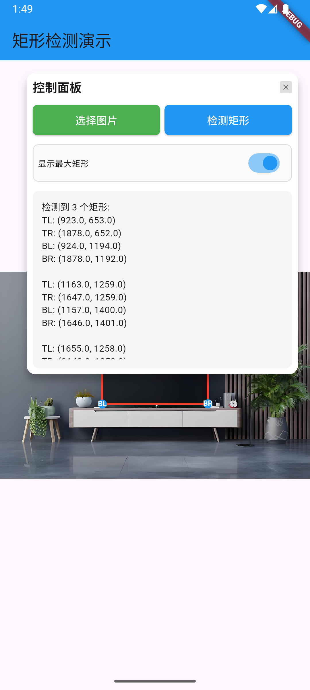
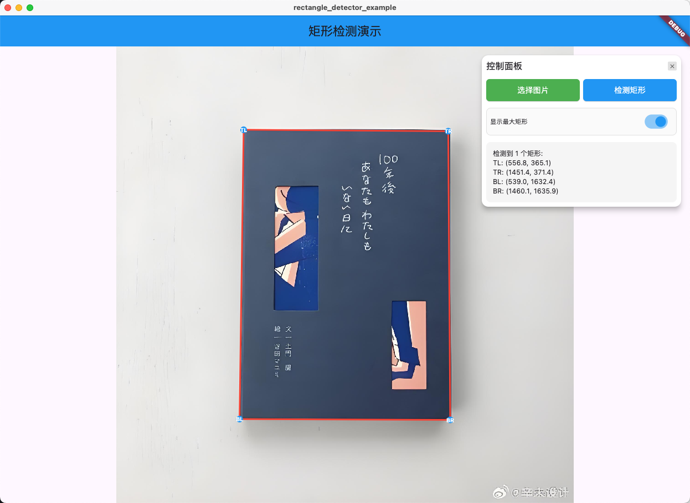

# Rectangle Detector

[](https://pub.dev/packages/rectangle_detector)
[](https://opensource.org/licenses/MIT)
[](https://flutter.dev/)
[](https://dart.dev/)
[](https://flutter.dev/)
[](https://flutter.dev/)

一个基于原生平台的Flutter插件，提供高效的矩形特征点识别功能。支持从图像中检测矩形并返回精确的四个角点坐标。

## 功能特性

- 🔍 **高精度检测**：基于原生平台算法，提供准确的矩形识别
- 📱 **多平台支持**：支持 Android、iOS、macOS 和 Web 平台
- ⚡ **高性能**：原生实现，处理速度快
- 🎯 **灵活检测**：支持检测单个最大矩形或所有矩形
- 📐 **精确坐标**：返回矩形四个角点的精确坐标
- 🔄 **多种输入类型**：支持 Uint8List、ui.Image 和 ImageProvider 三种输入格式
- 🛠️ **易于集成**：简洁的 API 设计，快速集成到现有项目

## 支持平台

| 平台 | 支持状态 |
|------|----------|
| Android | ✅ |
| iOS | ✅ |
| macOS | ✅ |
| Web | ✅ |
| Windows | ❌ |
| Linux | ❌ |

## 演示效果

### Android 平台


### iOS 平台


### macOS 平台


### Web 平台


## 安装

在你的 `pubspec.yaml` 文件中添加依赖：

```yaml
dependencies:
  rectangle_detector: ^1.0.2
```

然后运行：

```bash
flutter pub get
```

## 使用方法

### 基本用法

```dart
import 'package:rectangle_detector/rectangle_detector.dart';
import 'dart:typed_data';
import 'dart:ui' as ui;
import 'package:flutter/widgets.dart';

// 方法1: 使用字节数据检测矩形
Future<void> detectRectangleFromBytes(Uint8List imageData) async {
  final rectangle = await RectangleDetector.detectRectangle(imageData);
  
  if (rectangle != null) {
    print('检测到矩形:');
    print('左上角: ${rectangle.topLeft}');
    print('右上角: ${rectangle.topRight}');
    print('左下角: ${rectangle.bottomLeft}');
    print('右下角: ${rectangle.bottomRight}');
  } else {
    print('未检测到矩形');
  }
}

// 方法2: 使用 ui.Image 检测矩形
Future<void> detectRectangleFromUIImage(ui.Image image) async {
  final rectangle = await RectangleDetector.detectRectangleFromImage(image);
  
  if (rectangle != null) {
    print('从 ui.Image 检测到矩形: ${rectangle.toString()}');
  }
}

// 方法3: 使用 ImageProvider 检测矩形
Future<void> detectRectangleFromProvider(ImageProvider imageProvider) async {
  final rectangle = await RectangleDetector.detectRectangleFromProvider(imageProvider);
  
  if (rectangle != null) {
    print('从 ImageProvider 检测到矩形: ${rectangle.toString()}');
  }
}

// 检测所有矩形（支持三种输入类型）
Future<void> detectAllRectangles(Uint8List imageData) async {
  final rectangles = await RectangleDetector.detectAllRectangles(imageData);
  
  print('检测到 ${rectangles.length} 个矩形');
  for (int i = 0; i < rectangles.length; i++) {
    final rect = rectangles[i];
    print('矩形 ${i + 1}: ${rect.toString()}');
  }
}

// 从 ui.Image 检测所有矩形
Future<void> detectAllRectanglesFromImage(ui.Image image) async {
  final rectangles = await RectangleDetector.detectAllRectanglesFromImage(image);
  print('从 ui.Image 检测到 ${rectangles.length} 个矩形');
}

// 从 ImageProvider 检测所有矩形
Future<void> detectAllRectanglesFromProvider(ImageProvider provider) async {
  final rectangles = await RectangleDetector.detectAllRectanglesFromProvider(provider);
  print('从 ImageProvider 检测到 ${rectangles.length} 个矩形');
}
```

### 完整示例

```dart
import 'package:flutter/material.dart';
import 'package:rectangle_detector/rectangle_detector.dart';
import 'package:image_picker/image_picker.dart';
import 'dart:typed_data';
import 'dart:io';

class RectangleDetectionPage extends StatefulWidget {
  @override
  _RectangleDetectionPageState createState() => _RectangleDetectionPageState();
}

class _RectangleDetectionPageState extends State<RectangleDetectionPage> {
  List<RectangleFeature> _detectedRectangles = [];
  bool _isDetecting = false;

  Future<void> _pickAndDetectImage() async {
    final picker = ImagePicker();
    final pickedFile = await picker.pickImage(source: ImageSource.gallery);
    
    if (pickedFile != null) {
      setState(() {
        _isDetecting = true;
      });
      
      try {
        final imageBytes = await File(pickedFile.path).readAsBytes();
        final rectangles = await RectangleDetector.detectAllRectangles(imageBytes);
        
        setState(() {
          _detectedRectangles = rectangles;
          _isDetecting = false;
        });
      } catch (e) {
        setState(() {
          _isDetecting = false;
        });
        ScaffoldMessenger.of(context).showSnackBar(
          SnackBar(content: Text('检测失败: $e')),
        );
      }
    }
  }

  @override
  Widget build(BuildContext context) {
    return Scaffold(
      appBar: AppBar(
        title: Text('矩形检测示例'),
      ),
      body: Column(
        children: [
          ElevatedButton(
            onPressed: _isDetecting ? null : _pickAndDetectImage,
            child: Text(_isDetecting ? '检测中...' : '选择图片并检测'),
          ),
          Expanded(
            child: ListView.builder(
              itemCount: _detectedRectangles.length,
              itemBuilder: (context, index) {
                final rect = _detectedRectangles[index];
                return ListTile(
                  title: Text('矩形 ${index + 1}'),
                  subtitle: Text('左上: ${rect.topLeft}, 右下: ${rect.bottomRight}'),
                );
              },
            ),
          ),
        ],
      ),
    );
  }
}
```

## API 文档

### RectangleDetector

主要的检测器类，提供矩形检测功能。支持三种输入类型：`Uint8List`、`ui.Image` 和 `ImageProvider`。

#### 检测单个矩形的方法

##### `detectRectangle(Uint8List imageData)`

从字节数据检测图像中的最大矩形。

**参数：**
- `imageData`: 图像的字节数据 (Uint8List)

**返回值：**
- `Future<RectangleFeature?>`: 检测到的矩形特征点，如果没有检测到则返回 null

##### `detectRectangleFromImage(ui.Image image)`

从 ui.Image 对象检测图像中的最大矩形。

**参数：**
- `image`: Flutter 的 ui.Image 对象

**返回值：**
- `Future<RectangleFeature?>`: 检测到的矩形特征点，如果没有检测到则返回 null

##### `detectRectangleFromProvider(ImageProvider imageProvider)`

从 ImageProvider 检测图像中的最大矩形。

**参数：**
- `imageProvider`: Flutter 的 ImageProvider 对象（如 AssetImage、NetworkImage 等）

**返回值：**
- `Future<RectangleFeature?>`: 检测到的矩形特征点，如果没有检测到则返回 null

#### 检测所有矩形的方法

##### `detectAllRectangles(Uint8List imageData)`

从字节数据检测图像中的所有矩形。

**参数：**
- `imageData`: 图像的字节数据 (Uint8List)

**返回值：**
- `Future<List<RectangleFeature>>`: 所有检测到的矩形特征点列表

##### `detectAllRectanglesFromImage(ui.Image image)`

从 ui.Image 对象检测图像中的所有矩形。

**参数：**
- `image`: Flutter 的 ui.Image 对象

**返回值：**
- `Future<List<RectangleFeature>>`: 所有检测到的矩形特征点列表

##### `detectAllRectanglesFromProvider(ImageProvider imageProvider)`

从 ImageProvider 检测图像中的所有矩形。

**参数：**
- `imageProvider`: Flutter 的 ImageProvider 对象（如 AssetImage、NetworkImage 等）

**返回值：**
- `Future<List<RectangleFeature>>`: 所有检测到的矩形特征点列表

### RectangleFeature

表示矩形特征点的数据类。

#### 属性

- `topLeft`: 左上角坐标 (Point<double>)
- `topRight`: 右上角坐标 (Point<double>)
- `bottomLeft`: 左下角坐标 (Point<double>)
- `bottomRight`: 右下角坐标 (Point<double>)

#### 方法

##### `fromMap(Map<String, dynamic> map)`

从 Map 数据创建 RectangleFeature 对象。

## 示例应用

本插件包含一个完整的示例应用，展示了如何：

- 选择图片进行检测
- 显示检测结果
- 在图像上绘制检测到的矩形
- 处理检测错误

运行示例：

```bash
cd example
flutter run
```

## 注意事项

1. **图像格式**：支持常见的图像格式（JPEG、PNG等）
2. **性能**：大图像可能需要较长的处理时间
3. **精度**：检测精度取决于图像质量和矩形的清晰度
4. **内存**：处理大图像时注意内存使用

## 常见问题

### Q: 为什么检测不到矩形？
A: 可能的原因：
- 图像中没有明显的矩形
- 图像质量较低或模糊
- 矩形边缘不够清晰
- 图像尺寸过小

### Q: 如何提高检测精度？
A: 建议：
- 使用高质量、清晰的图像
- 确保矩形边缘对比度足够
- 避免图像过度压缩
- 适当的图像尺寸（不要太小）

### Q: 支持实时检测吗？
A: 当前版本主要针对静态图像检测，实时检测功能将在后续版本中考虑添加。

## 贡献

欢迎提交 Issue 和 Pull Request！

## 许可证

本项目采用 MIT 许可证 - 查看 [LICENSE](LICENSE) 文件了解详情。

